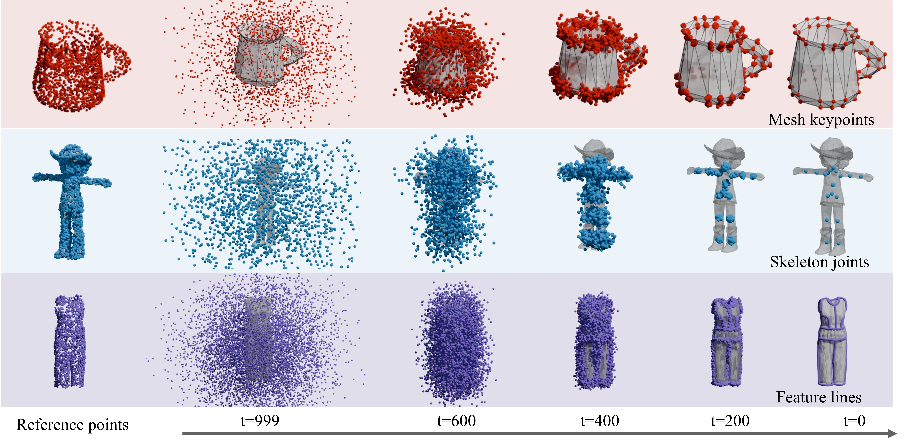

# PDT
Official Implementation of SIGGRAPH 2025 paper "Point Distribution Transformation with Diffusion Models"

<p align="center">
  
</p>


**[Project Page](https://shanemankiw.github.io/PDT)** | **[Paper](https://arxiv.org/abs/2507.18939)**

>Point-based representations have consistently played a vital role in geometric data structures. Most point cloud learning and processing methods typically leverage the unordered and unconstrained nature to represent the underlying geometry of 3D shapes. However, how to extract meaningful structural information from unstructured point cloud distributions and transform them into semantically meaningful point distributions remains an under-explored problem. We present PDT, a novel framework for point distribution transformation with diffusion models. Given a set of input points, PDT learns to transform the point set from its original geometric distribution into a target distribution that is semantically meaningful. Our method utilizes diffusion models with novel architecture and learning strategy, which effectively correlates the source and the target distribution through a denoising process. Through extensive experiments, we show that our method successfully transforms input point clouds into various forms of structured outputs - ranging from surface-aligned keypoints, and inner sparse joints to continuous feature lines. The results showcase our framework's ability to capture both geometric and semantic features, offering a powerful tool for various 3D geometry processing tasks where structured point distributions are desired.



## Applications

<p align="center">
  
</p>
<p align="center"><em>Results & denoising processes of mesh keypoints prediction.</em></p>

<p align="center">
  
</p>
<p align="center"><em>Results & denoising processes of skeletal joints prediction.</em></p>

<p align="center">
  
</p>
<p align="center"><em>Results & denoising processes of feature line extraction.</em></p>


## Core Idea

<p align="center">
  
</p>
<p align="center"><em>We pair noisy points from Gaussian distribution each with an input point as a per-point reference. Then, our diffusion model is trained to drag and denoise the Gaussian noise into a desired structural points distribution.</em></p>

## Citation

If you find this work helpful, please consider cite our paper:
```bibtex
@inproceedings{10.1145/3721238.3730717,
author = {Wang, Jionghao and Lin, Cheng and Liu, Yuan and Xu, Rui and Dou, Zhiyang and Long, Xiaoxiao and Guo, Haoxiang and Komura, Taku and Wang, Wenping and Li, Xin},
title = {PDT: Point Distribution Transformation with Diffusion Models},
year = {2025},
isbn = {9798400715402},
publisher = {Association for Computing Machinery},
address = {New York, NY, USA},
url = {https://doi.org/10.1145/3721238.3730717},
doi = {10.1145/3721238.3730717},
series = {SIGGRAPH Conference Papers '25}
}
```

